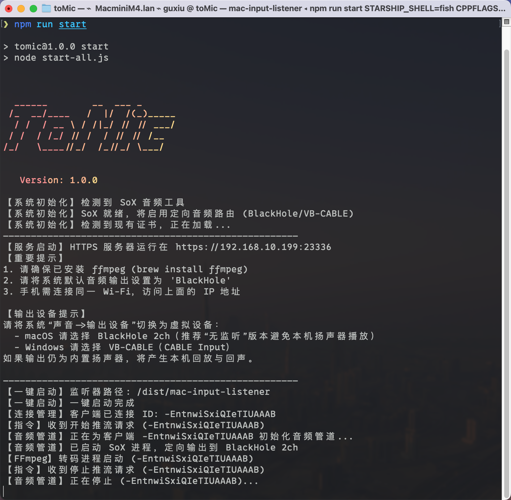

# ToMic - Turn Your Phone into a PC Microphone 🎙️

[](https://opensource.org/licenses/MIT)
[](https://github.com/nocmt/toMic)
[](https://nodejs.org/)

**ToMic** 是一个基于 Web 技术的局域网虚拟麦克风工具。它允许你使用手机浏览器作为电脑的麦克风输入源，通过 Wi-Fi 传输音频，并利用虚拟声卡（如 BlackHole 或 VB-CABLE）将其注入到系统音频输入中。

适用于 Zoom、Teams、Discord 或任何需要高质量麦克风输入的场景，尤其是当你只有台式机而没有麦克风，或者笔记本麦克风损坏时。



## ✨ 特性

- **零 App 安装**：手机端无需安装 App，通过浏览器（Chrome/Safari）即可使用。
- **低延迟传输**：基于 WebSocket 和 Opus 编码，提供低延迟音频流。
- **安全连接**：自动生成自签名 SSL 证书，支持 HTTPS，满足浏览器对录音权限的安全要求。
- **智能路由**：集成 **SoX**，支持将音频定向输出到虚拟声卡（BlackHole/VB-CABLE），不占用系统扬声器。
- **原生集成**：
  - **macOS**: 原生 Swift 监听器。
  - **Windows**: 原生 Python/EXE 监听器，监控麦克风状态。

## 🛠️ 前置要求

### macOS
1. **Node.js** (v16+)
2. **BlackHole 2ch** (虚拟声卡)
   - 本项目 Release 包中已包含安装程序 `BlackHole2ch-0.6.1.pkg` (位于 `native/` 目录下)。
   - 双击安装，安装完成后在“音频 MIDI 设置”中可以看到 BlackHole 2ch 设备。
3. **音频处理工具**
   - 项目已内置 `ffmpeg` 和 `sox` 二进制文件，无需手动安装。

### Windows
1. **Node.js** (v16+)
2. **VB-CABLE** (虚拟声卡)
   - [下载并安装 VB-CABLE Driver](https://vb-audio.com/Cable/)
   - 安装后，系统会出现 "CABLE Input" (播放) 和 "CABLE Output" (录制) 设备。
3. **音频处理工具** (必须手动配置)
   - 本项目依赖 **FFmpeg** 和 **SoX** 进行音频转码与路由。
   - 由于文件较大，未直接包含在仓库中，请手动下载并放置于 `native/windows-listener/` 目录下：
     - **FFmpeg**: 下载 `ffmpeg.exe` ([下载地址](https://github.com/GyanD/codexffmpeg/releases)) -> 放入 `native/windows-listener/ffmpeg.exe`
     - **SoX**: 下载 `sox.exe` 及相关 DLL ([下载地址](https://github.com/turbulentie/sox-dsd-win/blob/main/sox-dsd-win32_64.zip)) -> 放入 `native/windows-listener/sox.exe` (需包含 zlib1.dll 等依赖文件)

## 🚀 快速开始

### 1. 安装依赖

```bash
git clone https://github.com/nocmt/tomic.git
cd tomic
npm install
```

### 2. 启动服务

我们提供了一键启动脚本，会自动检测操作系统并启动相应服务：

```bash
npm run start
# 或者
node start-all.js
```

**Windows 用户注意**：
- 首次启动时，脚本会自动检测 `native/windows-listener/` 下的 `ffmpeg.exe` 和 `sox.exe`。
- 如果缺失，控制台会提示下载链接，请按提示补充文件。
- 音频会自动路由到 **"CABLE Input (VB-Audio Virtual Cable)"**。

### 3. 连接手机

1. 启动后，终端会显示 HTTPS 地址（例如 `https://192.168.1.5:23336`）。
2. 确保手机和电脑连接在**同一 Wi-Fi** 下。
3. 打开手机浏览器（推荐 Safari 或 Chrome），输入上述地址。
4. 由于使用自签名证书，浏览器会提示“连接不安全”：
   - 点击“高级” -> “继续访问” (Proceed to...)。
5. 点击页面上的 **“授权”** 按钮。

### 4. 配置应用

#### macOS
- 在会议软件中，麦克风选择 **BlackHole 2ch**。

#### Windows
- 确保系统默认**播放**设备已设置为 **VB-CABLE (CABLE Input)**（脚本会自动尝试路由，但建议检查）。
- 在会议软件（Zoom/Teams等）中，**麦克风**选择 **CABLE Output (VB-Audio Virtual Cable)**。
- **扬声器**选择你的物理耳机或音响（不要选 CABLE Input，否则听不到声音）。

> **原理**：手机声音 -> 电脑 Server -> SoX -> CABLE Input (虚拟线缆入口) -> CABLE Output (虚拟线缆出口) -> 会议软件

## ⚙️ 常见问题

**Q: Windows 下没有声音？**
A: 
1. 检查 `native/windows-listener/` 下是否已放入 `sox.exe` 和 `ffmpeg.exe`。
2. 检查 Windows 系统声音设置，确保 **CABLE Input** 已启用。
3. 检查会议软件的麦克风是否选择了 **CABLE Output**。

**Q: 为什么浏览器提示不安全？**
A: 因为我们在局域网内使用自签名的 SSL 证书以启用 HTTPS（麦克风权限必须）。这是正常现象，请放心继续访问。

**Q: 为什么会有回声？**
A: 请确保电脑端的音频输出（扬声器）**不要**选虚拟声卡（BlackHole/VB-CABLE），同时确保手机不要离电脑扬声器太近，或者戴上耳机。

**Q: 报错 `ffmpeg exited with code 255`**
A: 这是正常的进程退出日志，表示音频流已正常断开，请忽略。

## 📂 项目结构

```
.
├── certs/              # 自动生成的 SSL 证书 (已忽略)
├── native/             
│   ├── macos-listener/    # macOS 原生监听器 (Swift)
│   └── windows-listener/  # Windows 监听器 (Python/EXE + 工具集)
├── public/             # 前端页面
├── server.js           # 核心音频服务 (Node.js + FFmpeg)
├── start-all.js        # 启动脚本 (跨平台)
├── build-release.js    # macOS 打包脚本
└── ...

## 📦 打包与分发

### macOS 打包指南

#### 1. 准备依赖文件
在打包前，请确保以下文件已放置在正确位置：

```bash
# 手动下载并放置依赖文件
# macOS 依赖 (放入 native/ 目录):
native/
├── mac-input-listener      # 从 native/macos-listener/dist/ 复制
├── ffmpeg                  # 下载: https://evermeet.cx/ffmpeg/
├── sox                     # 通过 brew install sox 安装后复制
└── BlackHole2ch-0.6.1.pkg  # BlackHole 安装包
```

#### 2. 执行打包
运行打包脚本自动创建分发包：

```bash
# 安装打包工具
npm install --save-dev pkg

# 执行打包 (自动检测架构)
npm run build
```

打包完成后，会在 `release/ToMic-macOS/` 目录生成完整的发布包：

会有架构的区别，根据用户的操作系统架构，会生成不同的发布包。

```
release/ToMic-macOS/
├── toMic                 # 主程序 (Node.js 打包)
├── README.md            # 说明文档
└── native/              # 依赖目录
    ├── mac-input-listener  # macOS 监听器
    ├── ffmpeg              # FFmpeg 二进制
    ├── sox                 # SoX 音频工具
    └── BlackHole2ch-0.6.1.pkg  # 虚拟声卡安装包
```

#### 3. 分发给用户
将 `ToMic-macOS` 文件夹压缩后分发给用户：

```bash
# 创建压缩包
cd release
zip -r ToMic-macOS.zip ToMic-macOS/
```

### 用户使用说明

#### 首次使用步骤：
1. **解压下载的压缩包**
2. **安装 BlackHole 虚拟声卡**：
   ```bash
   # 双击安装 native/BlackHole2ch-0.6.1.pkg
   # 或在终端运行: sudo installer -pkg native/BlackHole2ch-0.6.1.pkg -target /
   ```
3. **配置音频设置**：
   - 打开 "音频 MIDI 设置"
   - 创建多输出设备，包含 BlackHole 2ch 和你的物理扬声器
   - 设置系统默认输出为多输出设备
4. **运行程序**：
   ```bash
   # 双击 toMic 文件
   # 或在终端运行: ./toMic
   ```
5. **连接手机**：打开浏览器访问显示的 HTTPS 地址

#### 依赖文件说明：
- **ffmpeg**: 音频转码工具，必须包含在 native/ 目录
- **sox**: 音频路由工具，必须包含在 native/ 目录  
- **mac-input-listener**: macOS 原生状态监听器
- **BlackHole2ch-0.6.1.pkg**: 虚拟声卡安装程序

### Windows 打包说明

Windows 版本主要依赖手动配置：
1. 用户需要手动下载并放置 `ffmpeg.exe` 和 `sox.exe` 到 `native/windows-listener/`
2. 安装 VB-CABLE 虚拟声卡
3. 构建 Python 监听器 (可选):
   ```bash
   cd native/windows-listener
   pip install -r requirements.txt
   pyinstaller --onefile --noconsole mic_listener.py
   ```

## 📄 License

本项目采用 MIT 许可证。详见 LICENSE 文件。

